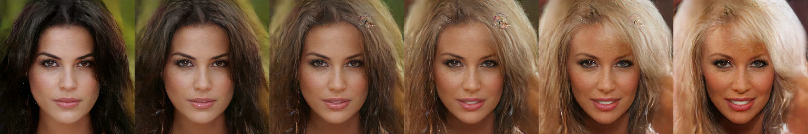
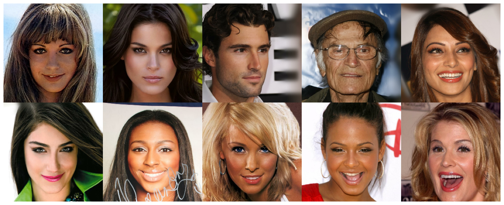
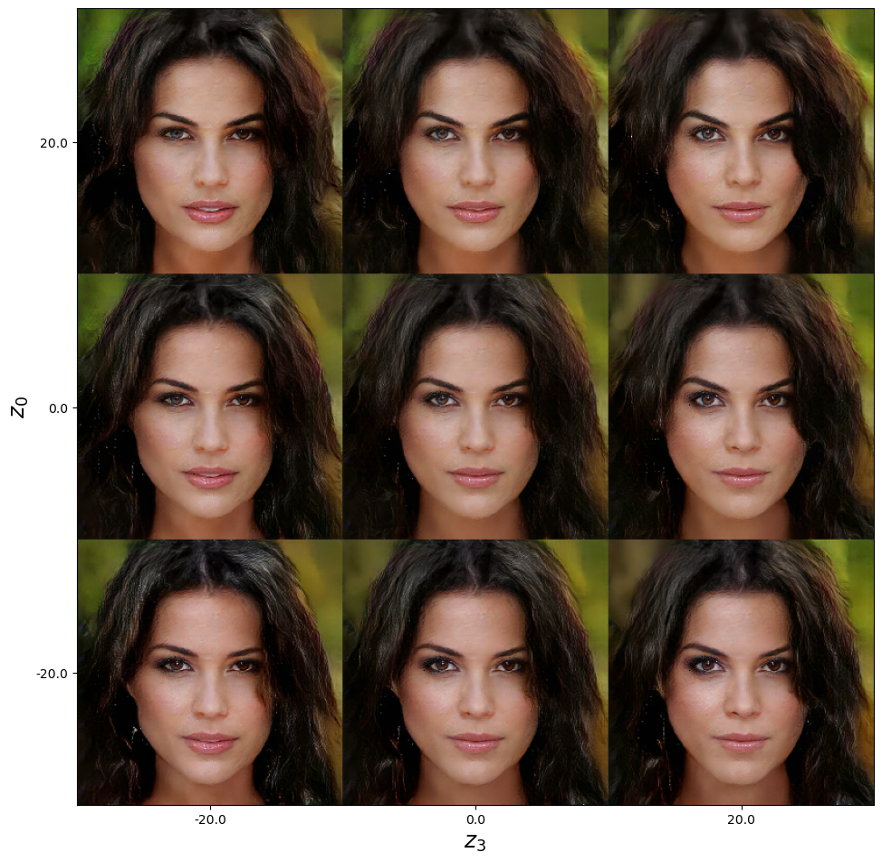
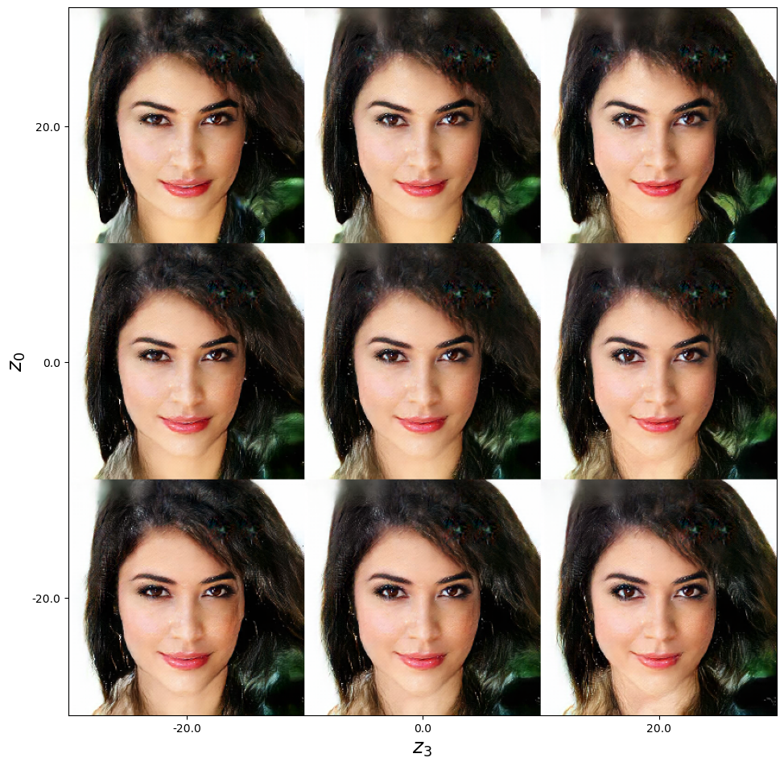
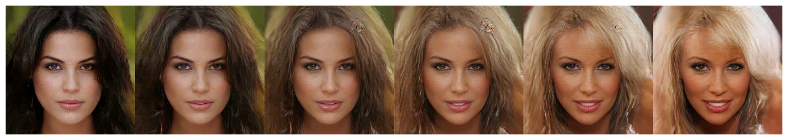
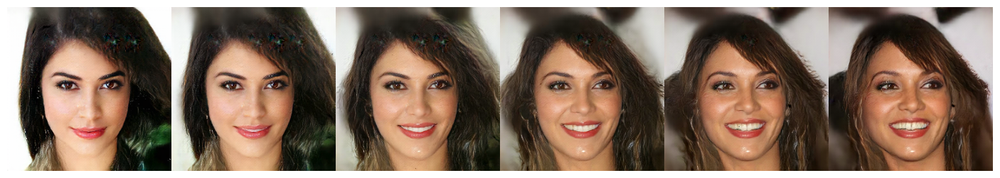

# How To Train Your VAE



Code for 

M. Rivera, How to train your VAE, ICIP 2024.

**By**

Mariano Rivera, version 1.4.3, june 2024


MIT Licence

**Inspired in** 

* The example Tesorflow.Keras VAE  [F. Chollet, Convolutional Variational AutoEncoder (VAE) trained on MNIST digits](https://keras.io/examples/generative/vae/), created 2020/05/03, last version 2020/05/03.

* Example in Chap 3 in [D. Foster, Generative deep learning, OReilly, 2019](https://www.oreilly.com/library/view/generative-deep-learning/9781492041931/)

___________________


## Import libraries


```python
import os
os.environ["TF_GPU_ALLOCATOR"]="cuda_malloc_async"
os.environ["TF_ENABLE_ONEDNN_OPTS"]="0"
```


```python
import numpy as np
import matplotlib.pyplot as plt
import tensorflow as tf
import keras
from keras import layers
import os
from glob import glob
```

## Load CelebA-HQ Dataset

[Celeb_a_hq Male/Female](https://www.kaggle.com/lamsimon/celebahq?select=celeba_hq)

Lui et al., 2015) Z. Lui et al. Deep Learning Face Attributes in the Wild, Proc ICCV 2015.


```python
# run params
DATA_FOLDER   = "/home/mariano/Data/CelebAMask-HQ/CelebA-HQ-img/"   # solitario
DIR_RESULTS   = './results'
PATH_RESULTS  = os.path.join(os.path.abspath('.'),DIR_RESULTS)
INPUT_DIM     = (256,256,3)
BATCH_SIZE    = 10
EPOCHS        = 200
LATENT_DIM    = 512
R_LOSS_FACTOR = 5000
INITIAL_EPOCH = 0

filenames  = np.array(glob(os.path.join(DATA_FOLDER, '*.jpg')))
```


```python
n_images        = filenames.shape[0]
steps_per_epoch = n_images//BATCH_SIZE
print('num image files : ', n_images)
print('steps per epoch : ', steps_per_epoch )
```

    num image files :  30000
    steps per epoch :  3000


The datasets


```python
AUTOTUNE = tf.data.AUTOTUNE
dataset=keras.utils.image_dataset_from_directory(directory  = DATA_FOLDER, 
                                                    labels     = None, 
                                                    batch_size = BATCH_SIZE, 
                                                    image_size = INPUT_DIM[:2],
                                                    shuffle    = True,
                                                    validation_split = 0.2,
                                                    subset     = "training",
                                                    seed       = 1967,).repeat()

dataset_val=keras.utils.image_dataset_from_directory(directory  = DATA_FOLDER, 
                                                    labels     = None, 
                                                    batch_size = BATCH_SIZE, #*10, 
                                                    image_size = INPUT_DIM[:2],
                                                    shuffle    = True,
                                                    validation_split = 0.2,
                                                    subset     = "validation",
                                                    seed       = 1967,).repeat()
```

    Found 30000 files.
    Using 24000 files for training.
    Found 30000 files.
    Using 6000 files for validation.


```python
dataset = dataset.prefetch(buffer_size=AUTOTUNE)

data_augmentation = keras.Sequential([
                                layers.RandomFlip    ("horizontal"),
                                layers.Rescaling     (scale=1./127.5, offset=-1),
                                ])
dataset = dataset.map(lambda x: (data_augmentation(x)), num_parallel_calls=AUTOTUNE)
```


```python
scaling = layers.Rescaling (scale=1./127.5, offset=-1)
dataset_val = dataset_val.map(lambda x: (scaling(x)), num_parallel_calls=AUTOTUNE)

```

Show some images


```python
X = []
for x in dataset_val.take(1): #num_img_rows*num_img_cols):
    X.append(x) 
    
Images_val = np.array(X)[0]
```


```python
from show_warps import show_many

num_img_rows, num_img_cols= 2,5
show_many(Images_val, m=num_img_rows, n=num_img_cols)

numImg, nrows, ncols, nchannels = np.array(Images_val).shape
print(numImg,nrows, ncols, nchannels)
```


    

    


    10 256 256 3


## Models


```python
import keras
import keras.layers as layers
from keras.layers import Dense, Conv2D, Conv2DTranspose, Flatten, Reshape
from keras.layers import Dropout, BatchNormalization, Activation, LeakyReLU
from keras.models import Model, Sequential

from tensorflow.python.framework.ops import disable_eager_execution
disable_eager_execution

from reader import ResEncoder, ResDecoder, Sampler
```

**VAE**


```python
from vae import VAE
```

**Discriminador**


```python
from discriminator import Discriminator
```

### VAE GAN


```python
class VAE_GAN(keras.Model):
    def __init__(self, r_loss_factor=1, summary=False, **kwargs):
        super().__init__(**kwargs)

        # Architecture
        self.input_dim                 = INPUT_DIM
        self.latent_dim                = LATENT_DIM
        self.use_batch_norm            = True
        self.use_dropout               = True
        self.r_loss_factor             = r_loss_factor
        
        # Encoder parameters
        self.encoder_conv_filters      = [128, 128, 128, 128, 128, 128, 128]
        self.encoder_conv_kernel_size  = [  3,   3,   3,   3,   3,   3, 3]
        self.encoder_conv_strides      = [  2,   2,   2,   2,   2,   2, 2]            
        # Decoder parameters
        self.decoder_conv_t_filters    = [128, 128, 128, 128, 128,  128, 3]
        self.decoder_conv_t_kernel_size= [  3,   3,   3,   3,   3,    3, 3]
        self.decoder_conv_t_strides    = [  2,   2,   2,   2,   2,   3, 2]
        # PatchGAN-Discriminator parameters
        self.discriminator_conv_filters     = [128, 128, 128,  64, 64,  1]
        self.discriminator_conv_kernel_size = [  3,   3,   3,   3,  3,  3]
        self.discriminator_conv_strides     = [  2,   2,   2,   1,  1,  1]

        # Metrics to track
        self.gen_loss_tracker = keras.metrics.Mean(name="gen_loss")
        self.dis_loss_tracker = keras.metrics.Mean(name="dis_loss")
        self.rl_loss_tracker  = keras.metrics.Mean(name="rl_loss")
        self.fk_gen_loss_tracker  = keras.metrics.Mean(name="fk_gen_loss")
        self.fk_dis_loss_tracker  = keras.metrics.Mean(name="fk_dis_loss")
        self.rc_loss_tracker  = keras.metrics.Mean(name="r_loss")
        self.kl_loss_tracker  = keras.metrics.Mean(name="kl_loss")
        self.mae              = keras.losses.MeanAbsoluteError()
        self.bce              = keras.losses.BinaryCrossentropy(from_logits=True)
        self.log              = tf.math.log
        
        # VAE
        self.vae_model = VAE(input_dim                 = self.input_dim,
                             latent_dim                = self.latent_dim,
                             encoder_conv_filters      = self.encoder_conv_filters, 
                             encoder_conv_kernel_size  = self.encoder_conv_kernel_size, 
                             encoder_conv_strides      = self.encoder_conv_strides, 
                             decoder_conv_t_filters    = self.decoder_conv_t_filters,
                             decoder_conv_t_kernel_size= self.decoder_conv_t_kernel_size, 
                             decoder_conv_t_strides    = self.decoder_conv_t_strides, 
                             r_loss_factor             = self.r_loss_factor,
                             summary                   = summary,
                            )
        
        # Discriminator
        self.discriminator_model = Discriminator(input_dim                      = self.input_dim,
                                                 discriminator_conv_filters     = self.discriminator_conv_filters, 
                                                 discriminator_conv_kernel_size = self.discriminator_conv_kernel_size, 
                                                 discriminator_conv_strides     = self.discriminator_conv_strides)
        
        self.built = True

    def get_config(self):
        config = super().get_config()
        config.update({"units": self.units})
        return config
    
    @property
    def metrics(self):
        return [self.dis_loss_tracker,
                self.gen_loss_tracker,
                self.rl_loss_tracker,
                self.fk_gen_loss_tracker,
                self.fk_dis_loss_tracker,
                self.rc_loss_tracker,
                self.kl_loss_tracker,
                ]
        
    @tf.function
    def train_step(self, data):
        '''
        '''
        # Los siguientes pasos registaran en dos "TAPE" para efectos de calcular dos gradientes
        with tf.GradientTape() as gen_tape, tf.GradientTape() as dis_tape:
            
            # generar fakes con vae
            data_hat, z, z_mean, z_log_var = self.vae_model(data)  
            
            # discrimina reales y prediccioes
            logits_real  = self.discriminator_model(data)          
            logits_fake  = self.discriminator_model(data_hat)      
                     
            # loss de reconstrucción
            rec_loss = self.r_loss_factor * self.mae(data, data_hat)

            # KL Loss original 
            #kl_loss = -0.5 * (1 + z_log_var - tf.square(z_mean) - tf.exp(z_log_var))
            #kl_loss = tf.reduce_mean(tf.reduce_sum(kl_loss, axis=1))

            # KL loss PROPUESTA
            # prueba del costo media de las medias y var de las medias)
            # las gaussianas P(z_i) de cada dato
            kl_loss_ind = -0.1 * (1 + z_log_var - tf.exp(z_log_var))            
            kl_loss_ind = tf.reduce_mean(tf.reduce_sum(kl_loss_ind, axis=1))
            # la gaussiana P(Z) de la población
            Z_mean    = tf.reduce_mean(z_mean, axis=0)                           
            Z_log_var = tf.math.log(tf.math.reduce_variance(z_mean, axis=0))
            kl_loss = -0.5 * (1 + Z_log_var - tf.square(Z_mean) - tf.exp(Z_log_var))
            kl_loss = tf.reduce_sum(kl_loss, axis=0)
            
            # loss verdaderas y generadas
            rl_dis_loss = 100*self.bce(tf.ones_like (logits_real),logits_real)
            fk_dis_loss = 100*self.bce(tf.zeros_like(logits_real),logits_fake)
            fk_gen_loss = 100*self.bce(tf.ones_like (logits_real),logits_fake)
                                                
            gen_loss =  rec_loss + kl_loss + kl_loss_ind + fk_gen_loss
            dis_loss =  rl_dis_loss + fk_dis_loss 
        
        # generator (vae) gradient
        gen_grads = gen_tape.gradient(gen_loss, self.vae_model.trainable_weights)        
        # discriminator gradient
        dis_grads = dis_tape.gradient(dis_loss, self.discriminator_model.trainable_weights)
        
        # generator train step
        self.generator_optimizer.apply_gradients(zip(gen_grads, self.vae_model.trainable_weights))
        # discriminator train step
        self.discriminator_optimizer.apply_gradients(zip(dis_grads, self.discriminator_model.trainable_weights))
        
        # compute progress        
        self.gen_loss_tracker.update_state(gen_loss)
        self.dis_loss_tracker.update_state(dis_loss)
        self.rc_loss_tracker.update_state(rec_loss)     # reconstruction loss
        self.kl_loss_tracker.update_state(kl_loss)
        self.rl_loss_tracker.update_state(rl_dis_loss) 
        self.fk_gen_loss_tracker.update_state(fk_gen_loss)
        self.fk_dis_loss_tracker.update_state(fk_dis_loss)
                
        return {"gen_loss"    : self.gen_loss_tracker.result(),
                "dis_loss"    : self.dis_loss_tracker.result(),
                "rc_loss"     : self.rc_loss_tracker.result(),
                "kl_loss"     : self.kl_loss_tracker.result(),
                "rl_loss"     : self.rl_loss_tracker.result(),
                "fk_gen_loss" : self.fk_gen_loss_tracker.result(),
                "fk_dis_loss" : self.fk_dis_loss_tracker.result(),
                }

    @tf.function
    def generate(self, z_sample):
        '''
        We use the sample of the N(0,I) directly as  
        input of the deterministic generator. 
        '''
        return self.vae.generate(z_sample)

    @tf.function
    def codify(self, images):
        '''
        For an input image we obtain its particular distribution:
        its mean, its variance (unvertaintly) and a sample z of such distribution.
        '''
        x = self.vae.encoder_model.predict(images)
        z, z_mean, z_log_var= self.vae.sampler_model(x)
        return z, z_mean, z_log_var
    
    # implement the call method
    @tf.function
    def call(self, inputs, training=False):
        '''
        '''
        data_hat,_,_,_ = self.vae_model(inputs, training)
        return data_hat
```

### Compile


```python
vae_gan = VAE_GAN(r_loss_factor=R_LOSS_FACTOR, summary=True)
vae_gan.summary()
```


<pre style="white-space:pre;overflow-x:auto;line-height:normal;font-family:Menlo,'DejaVu Sans Mono',consolas,'Courier New',monospace"><span style="font-weight: bold">Model: "vae_gan"</span>
</pre>


<pre style="white-space:pre;overflow-x:auto;line-height:normal;font-family:Menlo,'DejaVu Sans Mono',consolas,'Courier New',monospace">┏━━━━━━━━━━━━━━━━━━━━━━━━━━━━━━━━━┳━━━━━━━━━━━━━━━━━━━━━━━━━━━┳━━━━━━━━━━━━┓
┃<span style="font-weight: bold"> Layer (type)                    </span>┃<span style="font-weight: bold"> Output Shape              </span>┃<span style="font-weight: bold">    Param # </span>┃
┡━━━━━━━━━━━━━━━━━━━━━━━━━━━━━━━━━╇━━━━━━━━━━━━━━━━━━━━━━━━━━━╇━━━━━━━━━━━━┩
│ vae (<span style="color: #0087ff; text-decoration-color: #0087ff">VAE</span>)                       │ ?                         │  <span style="color: #00af00; text-decoration-color: #00af00">9,932,466</span> │
├─────────────────────────────────┼───────────────────────────┼────────────┤
│ discriminator (<span style="color: #0087ff; text-decoration-color: #0087ff">Discriminator</span>)   │ ?                         │    <span style="color: #00af00; text-decoration-color: #00af00">412,101</span> │
└─────────────────────────────────┴───────────────────────────┴────────────┘
</pre>


<pre style="white-space:pre;overflow-x:auto;line-height:normal;font-family:Menlo,'DejaVu Sans Mono',consolas,'Courier New',monospace"><span style="font-weight: bold"> Total params: </span><span style="color: #00af00; text-decoration-color: #00af00">10,344,567</span> (39.46 MB)
</pre>


<pre style="white-space:pre;overflow-x:auto;line-height:normal;font-family:Menlo,'DejaVu Sans Mono',consolas,'Courier New',monospace"><span style="font-weight: bold"> Trainable params: </span><span style="color: #00af00; text-decoration-color: #00af00">10,319,215</span> (39.36 MB)
</pre>


<pre style="white-space:pre;overflow-x:auto;line-height:normal;font-family:Menlo,'DejaVu Sans Mono',consolas,'Courier New',monospace"><span style="font-weight: bold"> Non-trainable params: </span><span style="color: #00af00; text-decoration-color: #00af00">25,352</span> (99.03 KB)
</pre>


```python
file_weights = "model_weights/vae_gan_model_300-511.weights.h5"
vae_gan.load_weights(file_weights)
```


```python
vae_gan.generator_optimizer     = keras.optimizers.Adam(1e-4, beta_1=0.5)
vae_gan.discriminator_optimizer = keras.optimizers.Adam(1e-4, beta_1=0.5)
vae_gan.compile()
```


```python
file_weights = "model_weights/vae_gan_model_300-511.weights.h5"
vae_gan.load_weights(file_weights)
```

## Fit


```python
# Uncomment only if your want to train the VAE

"""
BATCH_SIZE    = 20
EPOCHS        = 50
INITIAL_EPOCH = 100

history=vae_gan.fit(dataset,
                    batch_size      = BATCH_SIZE,
                    epochs          = EPOCHS+INITIAL_EPOCH,
                    initial_epoch   = INITIAL_EPOCH,
                    steps_per_epoch = steps_per_epoch,)

file_weights = os.path.join(PATH_RESULTS,"vae_gan_model_300-511.weights.h5")
vae_gan.save_weights(file_weights)
""";
```

## Results

$$
{\bf z}_i^\prime = {\bf z}_i + e_k \epsilon,
$$


```python
from show_warps import plot_latent_space

plot_latent_space(model=vae_gan.vae_model, image=Images_val[2,:,:,:], n=3,scale=20,latents_start=[0,3])
plot_latent_space(model=vae_gan.vae_model, image=Images_val[1,:,:,:], n=3,scale=20,latents_start=[0,3])
```


    

    


    

    


If fancy faces appeared, ther is a bug in the *model.weights* loader, reload the weights, compile and reload. 

## Convex Combinations of Latent Variables

$$
{\bf z}_k^\prime = (1-\alpha_k) \, {\bf z}_1 + \alpha_k \,{\bf z}_2,
$$

with $\alpha_k = k / (n-1)$; for  $k=0,1,\ldots,5$.


```python
from show_warps import plot_warping
```


```python
_, _,z1,_ = vae_gan.vae_model(np.expand_dims(Images_val[2,:,:,:], axis=0))  
_, _,z2,_ = vae_gan.vae_model(np.expand_dims(Images_val[5,:,:,:], axis=0))

_, _,z3,_ = vae_gan.vae_model(np.expand_dims(Images_val[1,:,:,:], axis=0))  
_, _,z4,_ = vae_gan.vae_model(np.expand_dims(Images_val[8,:,:,:], axis=0))
```


```python
plot_warping(model=vae_gan.vae_model, z1=z1 , z2=z2, n=6)
plot_warping(model=vae_gan.vae_model, z1=z3 , z2=z4, n=6, save_plot=False)
```


    

    


    

    


```python

```
